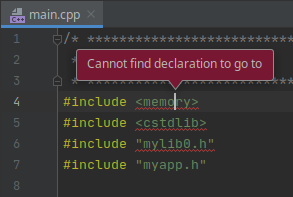

# cmake-metaproject-demo

*CMake meta project tracking multiple subprojects w/ dependencies.*

This setup aims to demonstrate a CMake meta project consisting of a flat list of components (libraries and executables).
Each component may have known compile and runtime dependencies to other ones, but does **not** resolve its dependencies in own scope.
The proper resolving of those dependencies is put to the **meta project** [configuration](source/CMakeLists.txt) instead - using a simple `AddComponent()` and `AddDependencies()` approach based on CMake's *ExternalProject*.

## Project structure

### Source folder

The `source` directory contains all code components as flat list (in-place or via git-submodules).
The real main [CMakeLists.txt](source/CMakeLists.txt) contains the simple approach to register components and dependencies.

### Helper scripts

* `build.sh` Trigger the build process
* `launch.sh` Launch the compiled executable
* `cleanup.sh` Delete all temporary files

### Generated temporary folders

* `workdir` Contains the generated CMake project files
* `build` Contains the generated build artifacts
* `sysroot` Contains the installed artifacts (libraries, executables, headers, config.cmake)

### CMakeLists.txt

The CMake project file in the root directory redirects to the real main CMakeLists.txt in the source folder. It's recommended to be used for importing the project in your IDE (e.g. CLion).

## Getting started

This meta project has been tested with Linux (Ubuntu 18.04 LTS) and CMake 3.11.2 (console) - and CLion 2019.3.3 / 2020.1 EAP (both with bundled CMake).

### Console

* Launch build script `build.sh`
* Start launcher using `launch.sh`

Expected output of launching:
```
$ ./launch.sh
[myapp] [void MyApp::Info() const] Hello from myapp :-)
[mylib0] [void MyLib0::Info() const] Hello from mylib0 :-)
[mylib1] [void MyLib1::Info() const] Hello from mylib1 :-)
```

### CLion IDE

#### Import CMake project

* Open CLion
* Choose "Open or Import"
* Select the `CMakeLists.txt` in the root directory
* "Open as Project"
* "Build" -> "Build Project"
* Open source file "source/myapp/src/main.cpp"

#### Checking indexer issues

**Q:** Is indexing working as expected?
**A:** No `:-|`

* In the project structure on the left side, right-click on the `source` folder and enable *"Mark Directory as"* -> *"Project Sources and Headers"*
* *"Tools"* -> *"CMake"* -> *"Reset Cache and Reload Project"*
* *"File"* -> *"Invalitate Caches / Restart..."* -> *"Invalidate and Restart"*
* Check indexing again

**Q:** Is indexing now working as expected?
**A:** No `:-(`

**Current status**

* The sub-project's internal header files seem to be indexed correctly
* Dependencies to other sub-projects are **not** indexed!
* C++ STL and system header files are **not** indexed!


(snippet of *source/myapp/src/main.cpp*)

**Q:** What's the correct way to enable/configure correct indexing of all source files of all sub-projects of the main project?

## License

This software is licensed under the [MIT license](LICENSE).
